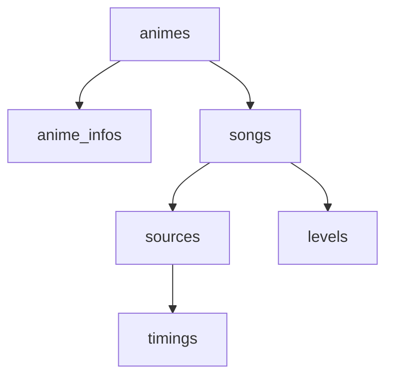

# Anime Opening Quiz Factory

## Project Overview

Anime Opening Quiz Factory is an automated system designed to create "Guess the Anime Opening/Ending" quiz videos. The system processes anime data from various sources, automatically finds and downloads opening/ending videos, determines optimal timings for quiz segments, assigns difficulty levels, and generates final quiz videos using customizable FFmpeg templates.

## Database Structure

The system uses a PostgreSQL database with the following core tables:

- **animes**: Stores anime information with MAL ID as primary key, titles, poster URLs, release year, and moderation flags
- **anime_infos**: Contains additional anime metadata from various sources, linked to animes
- **songs**: Represents openings and endings with category (OP/ED), numbering, and song metadata, linked to animes
- **sources**: Manages video sources for songs including download locations and status, linked to songs
- **timings**: Stores guess and reveal timestamps for quiz segments, linked to sources
- **levels**: Contains difficulty assessments for songs with values and attribution, linked to songs

### Database Relationships Schema

The database maintains important relationships between these entities through foreign key constraints. Each anime can have multiple songs (openings/endings), and each song can have multiple video sources. Sources can have multiple timing entries, and songs can have multiple difficulty levels from different assessment strategies.

## API Server

The FastAPI server provides RESTful endpoints for managing all database entities. It offers full CRUD operations for animes, songs, sources, timings, and levels. The API handles error cases with appropriate HTTP status codes and provides validation for all input data. The server structure follows a clean separation between routes, models, and service layers.

## Workers System

The project uses a worker-based architecture for automated processing tasks. Workers are independent processes that run concurrently and perform specific operations on the database. Each worker focuses on a single responsibility and uses configurable strategies to handle different scenarios.

Workers are designed to run in parallel with configurable intervals and concurrency settings. They operate by continuously polling the database for new work items, processing them according to their specific strategy, and updating the database with results. This separation allows different types of processing to happen simultaneously without blocking each other.

Key worker categories include source finding workers that search for video sources using different platforms, download workers that handle various download methods, timing workers that analyze videos for optimal quiz segments, and difficulty workers that assign challenge levels. The parallel architecture ensures system scalability and fault isolation.

## Web Interface

The web interface will provide comprehensive management capabilities for the entire system:

- View all data from the database including animes, anime infos, songs, sources, timings, and levels
- "Blocklist" button for anime - prevents any workers from touching the anime or any of its dependent entities, and excludes it from quiz videos
- "Finalize" button for anime - prevents workers from modifying its songs list
- Display download status for song sources showing when a source is currently downloading
- View all running workers with their current status and parameters
- Start new workers with specified parameters like strategy type and execution interval
- Stop existing workers

## Processing Pipeline

The system employs a decentralized processing approach where workers operate independently and in parallel. Unlike traditional sequential pipelines, these workers don't depend on each other's completion. A difficulty level worker can process any song as soon as it exists in the database, without waiting for sources to be found or downloaded. Similarly, source finding workers can search for videos regardless of timing or difficulty processing status.

This architecture allows maximum throughput and resilience. If one type of worker fails or is paused, other workers can continue processing available data. Each worker type focuses on its specific domain while sharing access to the central database, enabling efficient parallel processing across the entire anime catalog without coordination overhead.
